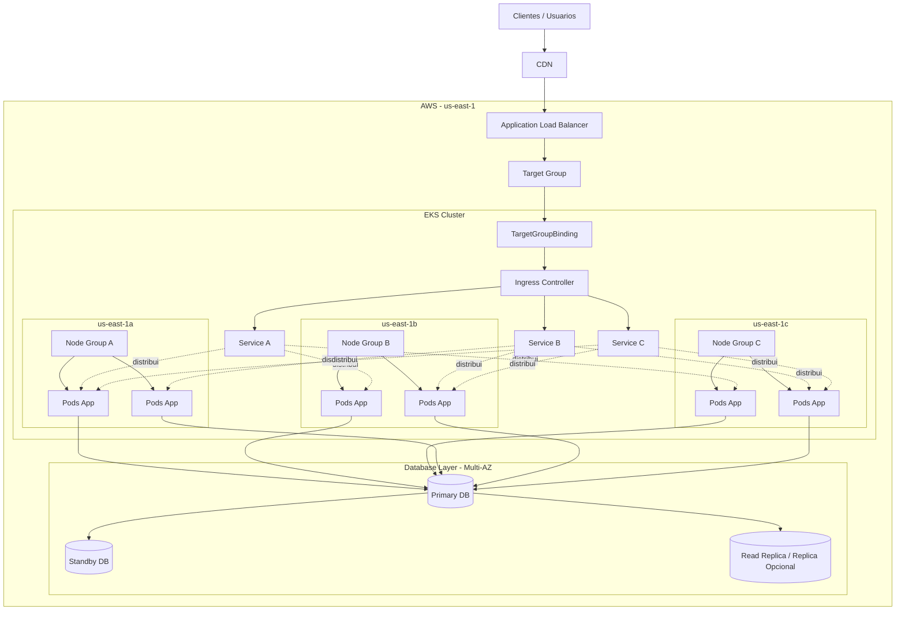

# Titulo: Plataforma Multi-Região em Kubernetes

Plataforma Kubernetes Multi-Region e Multi-Cluster na AWS para Workloads Críticos

Nivel: AVANCADO

Temas: Kubernetes, Engenharia de Plataforma, AWS, EKS, Multi-Region, Multi-Cluster, Resiliência, Disaster Recovery, GitOps, Governança, Observabilidade, Exposição de Tráfego, Continuidade Operacional, Rolling Upgrades de Plataforma, Platform as a Product

---

## Resumo do Problema

Uma empresa possui uma plataforma baseada em Kubernetes na AWS para hospedar aplicações internas e produtos críticos ao negócio. 

Atualmente, a maior parte dos workloads está concentrada em uma única região e, mesmo onde já existem clusters redundantes, a operação ainda depende excessivamente da disponibilidade individual de cada cluster. 

Isso gera preocupação com disponibilidade, continuidade operacional, blast radius e janelas de manutenção, especialmente em cenários de upgrades de versão do Kubernetes, atualização de componentes de rede, troca de add-ons críticos, correções de segurança e intervenções estruturais na plataforma.

O time de plataforma recebeu a responsabilidade de evoluir essa fundação para um modelo multi-region, permitindo que diferentes times publiquem aplicações com maior resiliência sem precisarem, individualmente, dominar toda a complexidade de DNS global, failover, replicação de dados, segurança, roteamento de tráfego, observabilidade distribuída e estratégias de deploy entre regiões.

Além disso, a solução não pode depender de apenas um cluster por região. Cada região deve possuir múltiplos clusters, de modo que seja possível retirar um cluster inteiro de operação para manutenção, upgrades ou correções sem indisponibilizar a região como um todo. Em outras palavras, a região precisa continuar funcional mesmo quando um de seus clusters estiver drenado, congelado para rollout ou temporariamente fora de serviço.

## Requisitos Funcionais

* A plataforma deve permitir que aplicações sejam implantadas em uma ou mais regiões da AWS por meio de um modelo padronizado e reutilizável.
* Cada região deve possuir múltiplos clusters Kubernetes, permitindo distribuição de workloads e continuidade operacional mesmo quando um cluster inteiro precisar ser retirado de serviço para manutenção, atualização ou correção.
* Deve ser possível classificar workloads por criticidade e associá-los a estratégias distintas de continuidade, como single-region com redundância intra-região, active-passive entre regiões ou active-active entre regiões.
* A solução deve permitir que aplicações sejam distribuídas entre clusters diferentes dentro da mesma região, reduzindo o risco de indisponibilidade regional causada por falha ou manutenção de um único cluster.
* A plataforma deve oferecer um mecanismo padronizado de entrega de aplicações, preferencialmente declarativo, permitindo que times publiquem mudanças sem precisar conhecer profundamente toda a topologia subjacente de regiões e clusters.
* A solução deve prover estratégias consistentes de exposição de tráfego para aplicações HTTP, gRPC e eventualmente workloads internos, suportando roteamento regional, failover entre regiões e balanceamento ou redistribuição entre clusters da mesma região.
* Deve existir uma abordagem clara para gerenciamento de configuração, secrets, identidade e permissões, garantindo que aplicações possam operar em múltiplas regiões e múltiplos clusters com segurança e rastreabilidade.

## Requisitos Não Funcionais
* A arquitetura deve reduzir blast radius e evitar que uma falha regional comprometa integralmente a operação da empresa.
* A solução deve reduzir também o blast radius intra-região, evitando que um problema ou manutenção em um único cluster torne a região indisponível.
* Deve haver consistência operacional entre regiões e entre clusters da mesma região, evitando deriva excessiva de configuração, componentes, políticas e processos de rollout.
* A solução deve permitir manutenção previsível da plataforma, com possibilidade de drenar ou desativar clusters inteiros sem interrupção de serviço para workloads adequadamente distribuídos.

## Plataforma de hoje 

